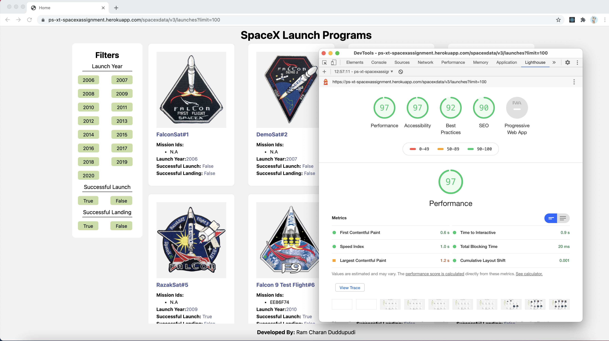

SpaceX Missions

An application used to filter data from http://api.spacexdata.com/ based on user preference, built with React, Next.js, JavaScript, and CSS.

## Installation and Setup Instructions

Clone down this repository. You will need `node` and `npm` installed globally on your machine.  

Installation:

`npm install`  
## Getting Started

First, run the development server:

```bash
npm run dev
# or
yarn dev
```

Open [http://localhost:3000](http://localhost:3000) with your browser to see the result.

You can start editing the page by modifying `pages/index.js`. The page auto-updates as you edit the file.

## Reflection

This was a 2 days project built as an assignment. Project goals included using technologies learned up until this point and familiarizing myself with documentation for new features.  

I started this process by using the `npx create-next-app` boilerplate.

One of the main challenges I ran into was Server Side Rendering and url change without refresh. This lead me to spend a some time on a research spike into Next.js, next/router.
## High Light House Score

